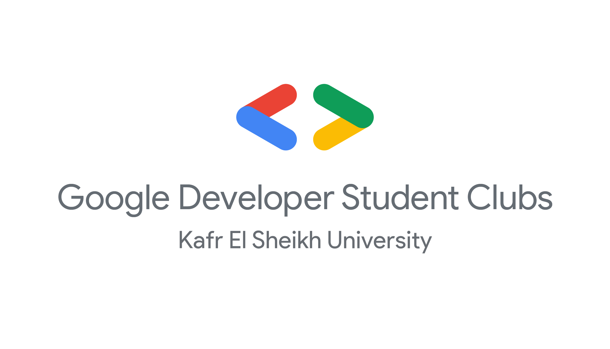

<h1 style="text-align:center">GDSC KSU Web Development</h1>

# Objectives

- **Give members the core concepts of web development**
- **Lead the members through their first steps in their development journey**
- **Help the newcomers to improve their programming skills**
- **Collaborative Project for GDSC Committees to benefit the upcoming members**

# Topics

- **World Wide Web**

  - [Why we need web?](#why-we-need-web)
  - [What is browser?](#what-is-browser)
  - [Front End vs Back End](#front-end-vs-back-end)

- **How The Internet Works**

  - [Internet Protocol (IP)](#internet-protocol-ip)
  - [UDP &#38; TCP &#38; TLS](#udp&tcp&tls)
  - [HTTP & HTTPS](#http&https)
  - [Domain Name Server (DNS)](#domain-name-server-dns)

- **Basics of HTML**
- **Basics of CSS**
- **Basics of JavaScript**

- **Front End Development**

  - [HTML and HTML5](#html-and-html5)
  - [CSS and CSS3](#css-and-css3)
  - [JavaScript](#javascript)
  - [How Browsers Render web pages](#how-browsers-render-web-pages)
  - [Introduction to Accessibility](#introduction-to-accessibility)
  - [Introduction to SEO](#introduction-to-seo)

- **Back End Development**

  - [ASP.NET core](#asp-net-core)
  - [REST API design](#rest-api-design)
  - [Cookies & Sessions](#cookies&sessions)
  - [Authentication](#authentication)
  - [Caching](#caching)
  - [CORS](#cors)

- **Version Control System**

  - [Git](#git)
  - [Github](#github)

# World Wide Web

## Why we need web?

## What is browser?

## Front End vs Back End

# How The Internet Works

## Internet Protocol (IP)

<h2 id="udp&tcp&tls">UDP & TCP & TLS</h2>

<h2 id="http&https">HTTP & HTTPS</h2>

## Domain Name Server (DNS)

# Basics of HTML

## Resources

| Resource                                                     | Estimated Time | Language | Category |
| ------------------------------------------------------------ | -------------- | -------- | -------- |
| [HTML Crash Course - Traversy Media](https://bit.ly/3QRQayD) | 1h             | English  | Video    |
| [HTML Crash Course - Codv Academy](https://bit.ly/3wAQiue)   | 1h 30m         | Arabic   | Video    |
| [HTML - Mozilla Developer Network](https://mzl.la/3cjgUZS)   | 30m            | English  | Article  |

## Sessions

| Link                                              | Category              |
|---------------------------------------------------|-----------------------|
| [HTML Basics Presentation](/sessions/HTML-basics/)| Presentation Material |

# Basics of CSS

## Resources

| Resource                                                    | Estimated Time | Language | Category |
| ----------------------------------------------------------- | -------------- | -------- | -------- |
| [CSS Crash Course - Traversy Media](https://bit.ly/2kDZGrl) | 1h             | English  | Video    |
| [CSS Crash Course - Codv Academy](https://bit.ly/3TjYdpq)   | 2h 00m         | Arabic   | Video    |
| [CSS - Mozilla Developer Network](https://mzl.la/3AQtIQI)   | 35m            | English  | Article  |

# Basics of JavaScript

## Resources

| Resource                                                        | Estimated Time | Language | Category |
| --------------------------------------------------------------- | -------------- | -------- | -------- |
| [JS Crash Course - Traversy Media](https://bit.ly/2LAxTa8)      | 1h 40m         | English  | Video    |
| [JS Crash Course - freeCodeCamp Arabic](https://bit.ly/3wz72lw) | 3h 12m         | Arabic   | Video    |
| [JS - Mozilla Developer Network](https://mzl.la/3wyerS2)        | 1h 30m         | English  | Article  |

# Front End Development

## HTML and HTML5

### Resources

| Resource                                                                | Estimated Time |   Language  | Category |
| ------------------------------------------------------------------------| -------------- | ----------- | -------- |
| [Learn HTML In Arabic 2021 - Elzero](https://bit.ly/3Rt2kOb)            |     4h 12m     | Arabic      |   Video  |
| [HTML Tutorial for Beginners - Net Ninja](https://bit.ly/3RtBw07)       |     2h 2m      | English     |   Video  |
| [HTML Elements Reference - MDN](https://mzl.la/3B2k24H)                 |     UNKNOWN    | English     | Reference|

## CSS and CSS3

### Resources

| Resource                                                                | Estimated Time |   Language  | Category |
| ------------------------------------------------------------------------| -------------- | ----------- | -------- |
| [Learn CSS In Arabic 2021 - Elzero](https://bit.ly/3TyI2oi)             |     11h 28m    | Arabic      |   Video  |
| [CSS Tutorial For Beginners - Net Ninja](https://bit.ly/2J1Vakp)        |     5h 43m     | English     |   Video  |
| [CSS Reference - MDN](https://mzl.la/3Q8I7fl)                           |     UNKNOWN    | English     | Reference|

## Challenge Time !

- [ ] [QR code component - Frontend Mentor](https://bit.ly/3TzuRn9) (Newbie)
- [ ] [Profile card component - Frontend Mentor](https://bit.ly/3cB0jRq) (Newbie)
- [ ] [Four card feature section - Frontend Mentor](https://bit.ly/3edkyF4) (Newbie)
- [ ] [Testimonials grid section - Frontend Mentor](https://bit.ly/3KDzhW5) (Junior)
- [ ] [Huddle landing page with curved sections - Frontend Mentor ](https://bit.ly/3q62z6k) (Junior)

## JavaScript

### Resources

| Resource                                                                | Estimated Time |   Language  | Category |
| ------------------------------------------------------------------------| -------------- | ----------- | -------- |
| [Learn JavaScript In Arabic 2021 - Elzero](https://bit.ly/3RrIq6c)      |     19h 20m    | Arabic      |   Video  |
| [JavaScript Tutorial For Beginners - Net Ninja](https://bit.ly/3Qc0Ero) |     4h 55m     | English     |   Video  |
| [JavaScript Reference - MDN](https://mzl.la/3Ro6oiU)                    |     UNKNOWN    | English     | Reference|
| [Eloquent JavaScript](https://bit.ly/2IgM2oY)                           |     UNKNOWN    | Translated  |   Book   |

## Challenge Time !

- [ ] [Interactive rating component - Frontend Mentor](https://bit.ly/3CQ34Zw) (Newbie)
- [ ] [Ping single column - Frontend Mentor](https://bit.ly/3TAFi9W) (Newbie)
- [ ] [Expenses chart component - Frontend Mentor](https://bit.ly/3AIp4mv) (Junior)
- [ ] [Sunnyside agency landing page - Frontend Mentor](https://bit.ly/3B8Kb2O) (Junior)
- [ ] [Calculator app - Frontend Mentor](https://bit.ly/3KErKGv) (Intermediate)
- [ ] [Todo app - Frontend Mentor](https://bit.ly/3CMgeXE) (Intermediate)
- [ ] [IP Address Tracker - Frontend Mentor](https://bit.ly/3Rx8vkc) (Intermediate)
- [ ] [Job listings with filtering - Frontend Mentor](https://bit.ly/3AAjnag) (Intermediate)

## How Browsers Render web pages

### Resources

| Resource                                                                | Estimated Time |   Language  | Category |
| ------------------------------------------------------------------------| -------------- | ----------- | -------- |
| [Webpage Rendering - QAREA](https://bit.ly/3cElp1d)                     |     15m        | English     |  Article |
| [Rendering - seobility](https://bit.ly/3RyuuYi)                         |     10m        | English     |  Article |
| [Populating the page - MDN](https://mzl.la/3AFpR7P)                     |     30m        | English     |  Article |
| [How Web Browser Works - Arabic Programmer](https://bit.ly/3B5tWDA)     |     8m         | Arabic      |  Article |
| [How Browser Render a Website - JSConf](https://bit.ly/3TzkIGZ)         |     30m        | English     |  Video   |
| [How browsers work - JSConf](https://bit.ly/3KNrW6o)                    |     20m        | English     |  Video   |

## Introduction to Accessibility

### Resources

| Resource                                                                   | Estimated Time |   Language  | Category |
| ---------------------------------------------------------------------------| -------------- | ----------- | -------- |
| [Accessibility - W3C](https://bit.ly/3KI9CeB)                              |     10m        | English     |  Article |
| [Introduction to Web Accessibility - W3C](https://bit.ly/2L7hGX8)          |     12m        | English     |  Article |
| [What is accessibility? - MDN](https://mzl.la/2FSGvWc)                     |     25m        | English     |  Article |
| [Accessibility Intro - Elzero](https://bit.ly/3AHjoJE)                     |     8m         | Arabic      |  Video   |
| [A WCAG Overview - Eric Eggert](https://bit.ly/3QpBF45)                    |     14m        | English     |  Video   |
| [Getting Started: Web Accessibility - Kevin Powell](https://bit.ly/3edh5q2)|     30m        | English     |  Video   |

## Introduction to SEO

### Resources

| Resource                                                                    | Estimated Time |   Language  | Category |
| ----------------------------------------------------------------------------| -------------- | ----------- | -------- |
| [SEO Starter Guide - Google](https://bit.ly/3RtGsSH)                        |     40m        | English     | Tutorial |
| [The Web Developer's SEO Cheat Sheet -  MDN](https://bit.ly/3QavGzQ)        |     35m        | English     |  Article |
| [10 SEO Tips - webfx](https://bit.ly/3CRWQbO)                               |     10m        | English     |  Article |
| [SEO for Developers - Fireship](https://bit.ly/3AHm1Lw)                     |     12m        | English     |  Video   |

# Back End Development

<h2 id="asp-net-core">ASP.NET core</h2>

## REST API design

<h2 id="cookies&sessions">Cookies & Sessions</h2>

## Authentication

## Caching

## CORS

# Version Control System

## Git

## Github

<!--

Do you want to know?
1. Internet
2. Internet Protocol (IP) Suite
3. IP Address
4. Transmission Control Protocol (TCP)
5. Packets and Data Link (Open Systems Interconnection(OSI) Model)
6. World Wide Web (WWW)
7. Hypertext Transfer Protocol (HTTP)
8. Uniform Resource Locator (URL)
9. Browser
10. Client
11. Server
12. HTTP Request
13. HTTP Response
14. HTTP Messages
15. Domain Name
16. Registrar
17. Internet Corporation for Assigned Names and Numbers (ICANN)
18. Domain Name System (DNS)
19. HyperText Markup Language (HTML)
20. Dev Tools
21. Code Editor
22. HTML Elements
23. HTML Forms
24. HTML Attributes
25. Anchor tag
26. Document Object Model (DOM)
27. Head
28. Body
29. Accessibility and Semantics
30. Div tag
31. Cascading Style Sheets (CSS)
32. Inline Style
33. CSS properties
34. Cascade
35. Style Tag
36. Selector
37. Class
38. CSS Specificity
39. External Stylesheet
40. Box Model
41. Block
42. Inline
43. Relative positioning 
44. Absolute positioning
45. Fixed positioning
46. Responsive Layout
47. Media Query
48. Flexbox
49. Grid Layout
50. calc() function
51. Custom Properties
52. Syntactically Awesome Stylesheets (SASS)
53. JavaScript
54. Script Tag
55. Defer attribute
56. ECMAScript
57. Let keyword
58. Const keyword
59. Dynamically Typed
60. TypeScript
61. Events
62. Browser API
63. Event Listener
64. Functions and Data Structures 
65. Array
66. Object
67. Primitive types
68. Prototypal Inheritance
69. Classes
70. Frontend Framework
71. Components
72. Declarative Code
73. Imperative Code
74. NodeJS
75. V8 Engine
76. Event Loop
77. Node Package Manager (NPM)
78. Module
79. Export statement
80. Import statement
81. Server-Side Rendering (SSR)
82. HTTP Methods
83. Status Code
84. 404 Not Found
85. Single-page application (SPA)
86. JavaScript Object Notation (JSON)
87. Static-Site Generation (SSG)
88. Hydration
89. First Contentful Paint (FCP) & Time to Interactive (TTI)
90. Fullstack Framework
91. Module Bundlers
92. Linter
93. Database
94. User Authentication
95. Web Server
96. Localhost
97. Cloud
98. Containers
99. Infrastructure as a service (IAAS) / Platform-as-a-Service (PAAS) / Backend-as-a-Service (BAAS) / Software as a service (SAAS)
100. World Wide Web-based on blockchain technology (Web3)
101. Google it.

-->
